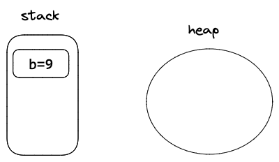
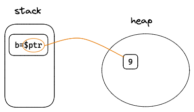

# 智能指针

## `Box<T>`

使用场景:
- 当有一个在编译时未知大小的类型，而又想要在需要确切大小的上下文中使用这个类型值的时候
- 当有大量数据并希望在确保数据不被拷贝的情况下转移所有权的时候
- 当希望拥有一个值并只关心它的类型是否实现了特定 trait 而不是其具体类型的时候

**没有使用 `Box<T>`**
```rust
    let b = 9;
    println!("b = {}", b);
```



使用 `Box<T>` 将数据存到堆上
```rust
    let b = Box::new(9);
    println!("b = {}", b);
```




## `Rc<T>`
- 引用计数智能指针
- 允许相同数据有多个所有者
- 数据在最后一个所有者离开作用域时才会被清理

```rust
    
use std::rc::Rc;

fn main(){
    let b = Rc::new(9);
    let a = Rc::clone(&b);
    println!("a = {}, b = {}",a,b);
}
```

### 查看引用到数量
每次执行 `Rc::clone()` 方法时，都会增加引用计数。可以使用 `Rc::strong_count()` 方法来查看引用到数量。

```rust
use std::rc::Rc;

fn main(){
    let b = Rc::new(9);
    let _a = Rc::clone(&b);
    let _c = Rc::clone(&b);
    println!("count = {}", Rc::strong_count(&b));
}
```